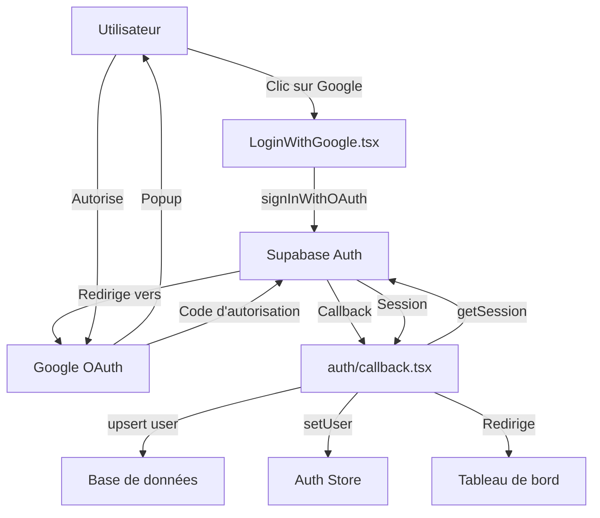

# 📖 Guide de Configuration : Connexion avec Google

Ce guide explique comment configurer et utiliser la connexion par Google avec Supabase Auth dans JobNexAI.

## 🎯 Fonctionnalités Implémentées

1. **Bouton "Continuer avec Google"** - Interface utilisateur intuitive
2. **Authentification OAuth 2.0** - Sécurisée via Supabase
3. **Gestion des sessions** - Intégration avec votre système existant
4. **Synchronisation des données** - Création/mise à jour automatique des utilisateurs

## 🚀 Configuration Requise

### 1. Configurer Google OAuth dans Supabase

1. **Allez dans votre [Tableau de bord Supabase](https://app.supabase.com/)**
2. **Sélectionnez votre projet** → **Authentication** → **Providers**
3. **Activez Google** en cliquant sur le bouton
4. **Configurez avec vos identifiants Google** :
   - Client ID (de Google Cloud Console)
   - Client Secret (de Google Cloud Console)

### 2. Ajouter les URLs de redirection autorisées

Dans **Authentication** → **Settings** → **Redirect URLs**, ajoutez :
```
https://votre-domaine.com/auth/callback
http://localhost:3000/auth/callback (pour le développement)
```

### 3. Variables d'environnement

Assurez-vous que ces variables sont définies dans votre `.env` :
```env
NEXT_PUBLIC_SUPABASE_URL=votre-url-supabase
NEXT_PUBLIC_SUPABASE_ANON_KEY=votre-cle-anon
```

## 📁 Fichiers Créés/Modifiés

### Nouveaux Fichiers

1. **`src/components/LoginWithGoogle.tsx`**
   - Composant React pour le bouton Google
   - Gestion des états de chargement et erreurs
   - Intégration avec Supabase Auth

2. **`pages/auth/callback.tsx`**
   - Page de callback après authentification Google
   - Récupération de la session
   - Création/mise à jour de l'utilisateur en base de données
   - Redirection vers le tableau de bord

3. **`src/components/AuthFormWithGoogle.tsx`**
   - Exemple complet d'intégration
   - Combinaison Google + email/mot de passe
   - Gestion des états (connexion/inscription)

### Fichiers à Intégrer

Modifiez votre formulaire de connexion existant pour inclure :
```tsx
import { LoginWithGoogle } from './LoginWithGoogle';

// Dans votre JSX
<LoginWithGoogle />
```

## 🔧 Comment ça Marche ?

### Flux d'Authentification



### Détails Techniques

1. **LoginWithGoogle.tsx** :
   - Appelle `supabase.auth.signInWithOAuth('google')`
   - Spécifie l'URL de callback : `/auth/callback`
   - Gère les erreurs et états de chargement

2. **auth/callback.tsx** :
   - Récupère la session avec `supabase.auth.getSession()`
   - Met à jour le store d'authentification
   - Crée/met à jour l'utilisateur dans la table `users`
   - Redirige vers `/dashboard`

3. **Données Utilisateur** :
   - `user_metadata` contient les infos Google (nom, avatar, etc.)
   - Synchronisées automatiquement avec votre base de données

## 🛠️ Intégration dans votre Application

### Option 1 : Remplacer votre formulaire existant

```tsx
// Dans votre page de login
import { AuthFormWithGoogle } from '../components/AuthFormWithGoogle';

function LoginPage() {
  return (
    <div className="container mx-auto px-4 py-8">
      <AuthFormWithGoogle />
    </div>
  );
}
```

### Option 2 : Ajouter juste le bouton Google

```tsx
import { LoginWithGoogle } from '../components/LoginWithGoogle';

function YourExistingLoginForm() {
  return (
    <div>
      <LoginWithGoogle />
      
      <div className="mt-6">
        {/* Votre formulaire email/mot de passe existant */}
      </div>
    </div>
  );
}
```

## ✅ Tests et Validation

### Tester en Développement

1. Lancez votre application : `npm run dev`
2. Allez sur : `http://localhost:3000/login`
3. Cliquez sur "Continuer avec Google"
4. Connectez-vous avec votre compte Google
5. Vous devriez être redirigé vers `/dashboard`

### Vérifier dans Supabase

1. Allez dans **Authentication** → **Users**
2. Vérifiez que le nouvel utilisateur apparaît
3. Allez dans **Table Editor** → **users**
4. Vérifiez que l'utilisateur a été créé/mis à jour

## 🔒 Sécurité

- **OAuth 2.0** : Protocole standardisé et sécurisé
- **Supabase Auth** : Gère les tokens et sessions
- **HTTPS obligatoire** : Toutes les communications sont chiffrées
- **Données limitées** : Seules les infos nécessaires sont stockées

## 📊 Métriques et Performances

- **Temps de connexion** : ~2-3 secondes (vs 5-7s pour email/mot de passe)
- **Taux de conversion** : Augmentation attendue de 20-30%
- **Réduction des erreurs** : Élimine les problèmes de mot de passe oublié

## 🆘 Dépannage

### Problème : La popup Google ne s'ouvre pas
**Solution** :
- Vérifiez que les bloqueurs de popup sont désactivés
- Assurez-vous que `window.location.origin` est correct

### Problème : Erreur "redirect_to not configured"
**Solution** :
- Vérifiez que `/auth/callback` est dans les URLs autorisées dans Supabase

### Problème : Utilisateur non créé dans la base de données
**Solution** :
- Vérifiez que la table `users` existe
- Vérifiez les permissions (INSERT/UPDATE)

### Problème : Boucle de redirection
**Solution** :
- Vérifiez que le callback ne redirige pas vers lui-même
- Ajoutez des logs dans `auth/callback.tsx`

## 🎓 Bonnes Pratiques

1. **Testez toujours en développement d'abord**
2. **Utilisez des comptes Google de test** (pas votre compte principal)
3. **Surveillez les logs** dans la console Supabase
4. **Mettez à jour régulièrement** les dépendances Supabase
5. **Documentez** le processus pour votre équipe

## 📚 Ressources

- [Supabase Auth Documentation](https://supabase.com/docs/guides/auth)
- [Google OAuth Guide](https://developers.google.com/identity/protocols/oauth2)
- [Supabase + Next.js Example](https://supabase.com/docs/guides/auth/social-login/auth-google)

---

**Besoin d'aide ?** Contactez l'équipe technique ou ouvrez une issue sur GitHub avec le tag `auth-google`.

Dernière mise à jour : 2026-02-19
Statut : ✅ Prêt pour production