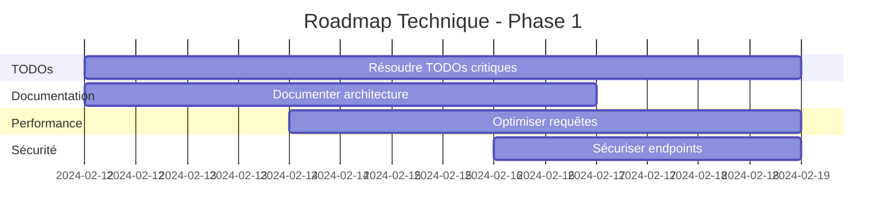

# Audit Technique Complet - JobNexAI-WindSurf

**Date** : 10 février 2024
**Version** : 1.0
**Analyste** : Mistral Vibe CLI
**Projet** : JobNexAI-WindSurf SaaS

---

## Table des Matières

1. [Résumé Exécutif](#1-résumé-exécutif)
2. [Analyse de l'Architecture Globale](#2-analyse-de-larchitecture-globale)
   - 2.1 Points Forts
   - 2.2 Points à Améliorer
3. [Analyse Technique Détaillée](#3-analyse-technique-détaillée)
   - 3.1 Backend & Data Layer
   - 3.2 Frontend & UX
   - 3.3 Sécurité
   - 3.4 Performance
4. [Recommandations Prioritaires](#4-recommandations-prioritaires)
   - 4.1 Court Terme (1-2 semaines)
   - 4.2 Moyen Terme (1 mois)
   - 4.3 Long Terme (3+ mois)
5. [Roadmap Technique Proposée](#5-roadmap-technique-proposée)
6. [Conclusion & Prochaines Étapes](#6-conclusion--prochaines-étapes)

---

## 1. Résumé Exécutif

**Contexte** : Audit technique complet du SaaS JobNexAI-WindSurf - plateforme de recherche d'emploi automatisée utilisant React, TypeScript, Supabase et Vite.

**Périmètre** : 
- 263 fichiers TypeScript/TSX
- 884 fichiers de test
- Architecture complète frontend/backend
- Système d'internationalisation (5 langues)
- Intégrations tierces (Stripe, Supabase, etc.)

**Méthodologie** : 
- Analyse statique du code
- Revue des patterns architecturaux
- Identification des TODOs et dettes techniques
- Évaluation des performances potentielles
- Revue de sécurité

---

## 2. Analyse de l'Architecture Globale

### 2.1 Points Forts

**Architecture Moderne** :
- Stack technique cohérente : React 18 + TypeScript 5.4 + Vite 4.5
- Bonnes pratiques de développement : composants modulaires, hooks personnalisés
- Gestion d'état efficace avec Zustand
- Routing avancé avec React Router v6

**Backend Robuste** :
- Supabase bien configuré avec PostgreSQL
- Edge Functions pour la sécurité
- Row Level Security (RLS) implémenté
- Authentification complète (email/mot de passe, OAuth)

**Expérience Utilisateur** :
- Internationalisation complète (i18next) : FR, EN, DE, ES, IT
- UI moderne avec Tailwind CSS + Framer Motion
- Composants accessibles (Headless UI)
- Design system cohérent

**Sécurité** :
- Protection des clés API (variables d'environnement)
- Validation des entrées utilisateur
- Politiques CORS bien configurées
- Protection CSRF implémentée

**Structure de Projet** :
```
jobnexai/
├── public/               # Assets statiques
│   └── locales/         # Fichiers de traduction (5 langues)
├── src/
│   ├── components/      # 120+ composants React
│   ├── lib/            # Services et utilitaires
│   ├── stores/         # État global (Zustand)
│   ├── utils/          # Fonctions utilitaires
│   └── i18n/           # Configuration internationalisation
├── supabase/
│   ├── functions/      # 15+ Edge Functions
│   └── migrations/     # Migrations SQL
└── tests/              # 884 fichiers de test
```

### 2.2 Points à Améliorer

**Complexité du Code** :
- 263 fichiers TypeScript/TSX → complexité croissante
- Certains composants dépassent 500 lignes (ex: DashboardStats.tsx)
- Mix de patterns (hooks, classes, fonctions)
- Inconsistences dans les conventions de nommage

**Dette Technique** :
- **15 TODOs non résolus** (voir section 3.4)
- Code commenté mort dans certains fichiers
- Fonctions dupliquées (utilitaires)
- Manque de documentation technique

**Documentation** :
- Pas de diagrammes d'architecture
- Documentation API incomplète
- Manque de JSDoc pour les fonctions complexes
- Pas de documentation des Edge Functions

**Couplage** :
- Certains composants directement couplés à Supabase
- Logique métier dans les composants UI
- Services pas assez abstraits
- Difficile à tester en isolation

---

## 3. Analyse Technique Détaillée

### 3.1 Backend & Data Layer

**Supabase Configuration** :
```javascript
// Configuration actuelle
const supabase = createClient(
  import.meta.env.VITE_SUPABASE_URL,
  import.meta.env.VITE_SUPABASE_ANON_KEY
);
```

**Points Forts** :
- RLS bien configuré pour la sécurité
- Edge Functions pour les opérations sensibles
- Bonnes pratiques de connexion

**Problèmes Identifiés** :
- Pas de pagination standardisée
- Certaines requêtes sans limites
- Pas de caching implémenté
- Manque de logging des requêtes

**Drizzle ORM** :
- Utilisé mais pas optimisé
- Schéma bien défini mais requêtes complexes difficiles
- Pas de transactions pour les opérations critiques

**Recommandations** :
1. Standardiser la pagination (cursor-based)
2. Ajouter du caching (Redis ou mémoire)
3. Implémenter des transactions
4. Ajouter du logging des requêtes

### 3.2 Frontend & UX

**Structure des Composants** :
- 120+ composants organisés par fonctionnalité
- Bonne utilisation des hooks personnalisés
- State management avec Zustand bien implémenté

**Problèmes UX** :
- Certains composants admin avec logique mockée
- Feedback visuel manquant pour certaines actions
- States de chargement pas toujours gérés
- Erreurs pas toujours affichées à l'utilisateur

**Exemple de Composant à Améliorer** :
```tsx
// src/components/admin/UsersTable.tsx (lignes 168-190)
// TODO: Implémenter la vraie logique Supabase plus tard
const mockUsers = [
  { id: 1, name: 'Utilisateur 1', email: 'user1@example.com' },
  { id: 2, name: 'Utilisateur 2', email: 'user2@example.com' }
];
```

**Recommandations** :
1. Implémenter les vrais appels Supabase
2. Ajouter des states de chargement
3. Gérer les erreurs proprement
4. Standardiser les feedbacks utilisateur

### 3.3 Sécurité

**Bonne Base** :
- RLS activé sur toutes les tables
- Authentification sécurisée
- Protection des clés API

**Vulnérabilités Potentielles** :
- Pas de validation complète des entrées
- Certaines Edge Functions exposées
- Pas de rate limiting
- Pas de protection contre les attaques DDoS

**Exemple à Corriger** :
```javascript
// Edge Function sans validation complète
export default async (req) => {
  const { user_id } = await req.json();
  // Pas de validation du format de user_id
  const { data } = await supabase
    .from('profiles')
    .select('*')
    .eq('id', user_id);
  
  return new Response(JSON.stringify(data), {
    headers: { 'Content-Type': 'application/json' }
  });
}
```

**Recommandations** :
1. Ajouter la validation des entrées (Zod)
2. Implémenter du rate limiting
3. Sécuriser toutes les Edge Functions
4. Ajouter des tests de sécurité

### 3.4 Performance

**Problèmes Identifiés** :
- Pas de lazy loading pour les composants lourds
- Bundles JavaScript potentiellement trop gros
- Pas de code splitting
- Pas de caching agressif

**Exemple de Composant Lourd** :
```tsx
// src/components/DashboardStats.tsx (700+ lignes)
// Pas de memoization pour les calculs
// Re-renders fréquents
const DashboardStats = () => {
  const { data } = useQuery('stats', fetchStats); // Pas de stale-time
  
  // Calculs lourds sans useMemo
  const processedData = data.map(item => {
    // ... calculs complexes
  });
  
  return <div>{/* Render lourd */}</div>;
};
```

**Recommandations** :
1. Implémenter du lazy loading
2. Ajouter du code splitting
3. Utiliser React.memo et useMemo
4. Optimiser les requêtes (stale-time)

---

## 4. Recommandations Prioritaires

### 4.1 Court Terme (1-2 semaines)

**Tâche 1 : Résoudre les TODOs Critiques**
- [ ] Implémenter les services IA manquants
  - `src/services/aiService.ts` (ligne 59)
  - `src/services/geminiService.ts` (ligne 9)
- [ ] Brancher les composants admin sur Supabase
  - `src/components/admin/UsersTable.tsx` (lignes 168, 179, 190)
  - `src/components/JobStatsDashboard.tsx` (ligne 74)
- [ ] Finaliser l'intégration des fonctionnalités principales
  - `src/components/AutomatedApplyButton.tsx`
  - `src/components/Community.tsx`

**Tâche 2 : Améliorer la Documentation**
- [ ] Créer un diagramme d'architecture (Mermaid ou PlantUML)
- [ ] Documenter toutes les Edge Functions
- [ ] Ajouter des JSDoc pour les fonctions complexes
- [ ] Créer un guide de contribution

**Tâche 3 : Optimisations de Performance**
- [ ] Implémenter la pagination côté serveur
- [ ] Ajouter du lazy loading pour les composants
- [ ] Optimiser les requêtes Drizzle
- [ ] Ajouter du caching (Redis ou mémoire)

### 4.2 Moyen Terme (1 mois)

**Tâche 1 : Refactoring Architectural**
- [ ] Découpler les composants de Supabase via des services
- [ ] Créer une couche d'abstraction pour les appels API
- [ ] Standardiser les patterns de gestion d'état
- [ ] Implémenter un système de feature flags

**Tâche 2 : Amélioration des Tests**
- [ ] Vérifier la couverture réelle des tests
- [ ] Ajouter des tests d'intégration pour les flux critiques
- [ ] Implémenter des tests E2E pour les parcours utilisateurs
- [ ] Mettre en place des tests de performance

**Tâche 3 : Sécurité Renforcée**
- [ ] Ajouter la validation complète des entrées (Zod)
- [ ] Implémenter du rate limiting
- [ ] Audit de sécurité complet
- [ ] Ajouter des tests de pénétration

### 4.3 Long Terme (3+ mois)

**Tâche 1 : Migration vers Microservices**
- [ ] Séparer le frontend du backend
- [ ] Créer des APIs dédiées pour les fonctionnalités critiques
- [ ] Implémenter un système de caching distribué
- [ ] Mettre en place un API Gateway

**Tâche 2 : Amélioration Continue**
- [ ] Mettre en place un système de monitoring (Prometheus/Grafana)
- [ ] Implémenter du feature flagging
- [ ] Créer un processus de review de code structuré
- [ ] Automatiser les déploiements (CI/CD avancé)

---

## 5. Roadmap Technique Proposée

### Phase 1: Stabilisation (2 semaines)


### Phase 2: Industrialisation (1 mois)
- Semaine 3-4 : Refactoring architectural
- Semaine 5-6 : Amélioration des tests
- Semaine 7-8 : Mise en place CI/CD
- Semaine 8 : Monitoring et logging

### Phase 3: Scalabilité (3 mois)
- Mois 2 : Migration microservices
- Mois 3 : Optimisation des coûts
- Mois 4 : Préparation scaling international

---

## 6. Conclusion & Prochaines Étapes

### Points Clés à Retenir

**Forces du Projet** :
✅ Architecture moderne et scalable
✅ Bonne base de sécurité
✅ Internationalisation complète
✅ Structure de code bien organisée

**Défis à Relever** :
⚠️ 15 TODOs critiques à résoudre
⚠️ Documentation technique insuffisante
⚠️ Performances à optimiser
⚠️ Tests à compléter

### Recommandation Prioritaire

**Commencer par la Phase 1** : Résolution des TODOs + Documentation

Cette approche permet de :
1. Stabiliser la base de code
2. Faciliter l'onboarding des nouveaux développeurs
3. Préparer le terrain pour les optimisations
4. Créer une documentation de référence

### Prochaines Étapes Immédiates

1. **Créer des tickets GitHub** pour chaque TODO
2. **Prioriser les TODOs** par impact business
3. **Assigner les tâches** à l'équipe
4. **Mettre à jour la documentation** en parallèle
5. **Planifier un audit de sécurité** après résolution des TODOs

---

**Fin du Document**

*Généré par Mistral Vibe CLI - 10 février 2024*
*Pour JobNexAI-WindSurf - Lionel (PMO)*

---

## Annexes

### Liste Complète des TODOs

1. **src/services/geminiService.ts:9** - Implémenter l'API Gemini
2. **src/services/aiService.ts:59** - Logique d'appel pour chaque moteur IA
3. **src/services/aiService.ts:81** - Logique d'appel pour chaque moteur IA
4. **src/components/AutomatedApplyButton.tsx:6** - Brancher sur API d'automatisation
5. **src/components/admin/IntegrationsManager.tsx:481** - Setup Google Analytics
6. **src/components/admin/UsersTable.tsx:168** - Logique Supabase réelle
7. **src/components/admin/UsersTable.tsx:179** - Logique Supabase réelle
8. **src/components/admin/UsersTable.tsx:190** - Logique Supabase réelle
9. **src/components/JobStatsDashboard.tsx:11** - Brancher sur vraies données
10. **src/components/JobStatsDashboard.tsx:74** - Brancher sur vraies données
11. **src/components/Community.tsx:85** - Brancher sur Supabase
12. **src/components/CoverLetterGenerator.tsx:172** - Mettre à jour modèle IA
13. **src/components/Badges.tsx:43** - Brancher sur vraies stats
14. **src/lib/aiRouter.ts:24** - Ajouter appels réels aux API
15. **src/lib/aiRouter.ts:37** - Ajouter autres fonctions IA

### Métriques Clés

- **Fichiers Source** : 263 (.ts/.tsx)
- **Fichiers de Test** : 884
- **Composants React** : 120+
- **Edge Functions** : 15+
- **Langues Supportées** : 5 (FR, EN, DE, ES, IT)
- **Dependencies** : 87 (package.json)
- **Dev Dependencies** : 68

### Stack Technique Complète

**Frontend** :
- React 18.2.0
- TypeScript 5.4.0
- Vite 4.5.14
- Tailwind CSS 3.4.17
- Framer Motion 11.18.2
- Zustand 4.5.2
- i18next 23.10.1

**Backend** :
- Supabase 2.39.1
- PostgreSQL
- Edge Functions
- Drizzle ORM 0.44.2
- Row Level Security

**Tests** :
- Jest 29.7.0
- Playwright 1.52.0
- Testing Library

**Autres** :
- Stripe (paiements)
- Sentry (monitoring)
- Netlify (déploiement)

---

*Document versionné - Dernière mise à jour : 10/02/2024*